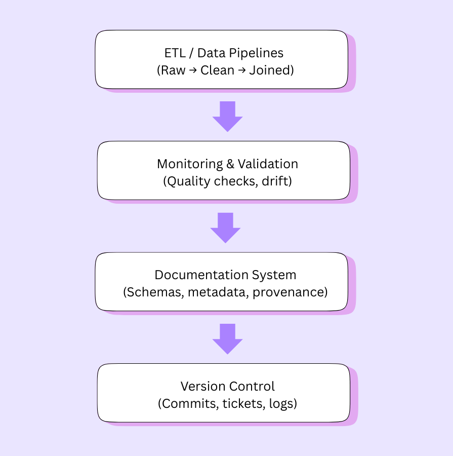
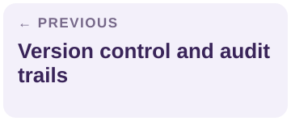

# Analytics workflows and documentation integration

[← Guide home](../README.md#documentation) · Document 7 of 10

## On this page

- [Put context where people use the data](#put-context-where-people-use-the-data)
- [Link documentation to dashboards and reports](#link-documentation-to-dashboards-and-reports)
- [Define metrics completely](#define-metrics-completely)
- [Connect documentation to model development](#connect-documentation-to-model-development)
- [Choose and document an evaluation split](#choose-and-document-an-evaluation-split)
- [Support deployment and ongoing use](#support-deployment-and-ongoing-use)
- [Automate updates through APIs and catalogs](#automate-updates-through-apis-and-catalogs)
- [Cross-functional handoff checklist](#cross-functional-handoff-checklist)

## Put context where people use the data

Documentation is most useful when people can reach it from their normal work: a dashboard, query, model experiment, or release record. A separate catalog can be comprehensive yet ineffective if consumers cannot identify which entry describes the data in front of them.

Use consistent dataset IDs and field names across documentation and consuming tools. Link both ways: a dashboard points to its upstream dataset record, and the dataset record identifies the dashboards and models that depend on it.

## Link documentation to dashboards and reports

For every important dashboard or report, include:

- Dataset name, stable ID, and version or live-table reference.
- A link to the authoritative dataset record.
- Responsible data owner and support route.
- Last successful refresh and last validation time, identified separately.
- Metric definitions, relevant filters, and known limitations.
- Time zone, reporting period, and whether recent values are provisional.

The original guide suggests short summaries, “Data Source” tooltips, hyperlinks, and Markdown widgets. Use the mechanism available in the team's BI platform, such as Looker or Tableau, and verify what that deployment supports. A label beside the metric is often enough to make an important caveat visible.

Do not expose restricted operational links to audiences who cannot use them. Provide a suitable summary or access-request route instead.

## Define metrics completely

A dataset dictionary describes fields; a metric definition explains a calculation and how to interpret it.

| Element | What to document |
| --- | --- |
| Business question | What decision or behavior the metric describes |
| Unit of analysis | User, account, session, subscription, transaction, or another entity |
| Calculation | Numerator, denominator, aggregation, and treatment of duplicates |
| Eligibility | Included population and exclusions |
| Time | Window, time zone, event versus ingestion time, and finalization rules |
| Segmentation | Filters, grouping fields, and comparability limits |
| Sources | Dataset and transformation references |
| Caveats | Missing coverage, provisional values, and known distortions |
| Ownership | Business definition owner and implementation maintainer |

**Illustrative daily active users definition:** count distinct eligible `user_id` values with at least one qualifying product event during a UTC calendar day. Exclude internal test accounts and list the qualifying events explicitly. Explain how opted-out users and late events affect coverage. An activity rate additionally needs a defined eligible-user denominator.

Do not interpret a change as product growth until changes in collection, eligibility, or calculation have been considered.

## Connect documentation to model development

A model experiment should identify the exact training, validation, and test data it used. Link the dataset record to the experiment, feature definitions, target definition, transformation revision, and evaluation results.

Record:

- Intended prediction and the decision it will inform.
- Prediction unit and prediction cutoff.
- Eligibility and population coverage.
- Feature observation windows and source availability at the cutoff.
- Label definition, label window, and when the outcome becomes observable.
- Split strategy, dates, assignment logic, and any random seed.
- Missing-data handling, feature transformations, and fitted preprocessing artifacts.
- Dataset limitations, known bias, and exclusions relevant to the intended use.

Distinguish “the event had happened” from “the system could know the event had happened.” Historical evaluation should reflect the information available to the deployed system.

## Choose and document an evaluation split

A split should reflect the question the evaluation is intended to answer. Record its rationale rather than adopting a random split by habit.

| Strategy | What it can help assess | Caveat to document |
| --- | --- | --- |
| Random row split | Performance under assumptions that observations are suitably independent and similarly distributed | Repeated entities or near-duplicate records can cross partitions |
| Group split | Performance on entities excluded from training | State the grouping key and how related entities are handled |
| Time-based split | Performance on later observations using earlier training data | Explain cutoffs, delayed labels, feature availability, and overlapping windows |
| Combined grouping and time rules | A deployment setting requiring both future and unseen-entity evaluation | Explain eligibility and the resulting sample sizes |

The same entity can legitimately appear in earlier training and later evaluation for some recurring prediction tasks. The documentation must explain why that matches deployment and how overlapping information is controlled.

Keep a final evaluation set separate from routine tuning decisions. Record what was evaluated and whether repeated inspection influenced development. See the [schema chapter](schema-and-metadata.md#prevent-time-and-training-data-leakage) for preprocessing guidance.

## Support deployment and ongoing use

Training documentation should connect to the deployed input contract. Record expected feature names, types, units, availability, freshness, missing-value behavior, and fallback decisions. Identify differences between training and serving transformations and explain how consistency is checked.

Link the model version to its approved dataset and feature revisions. Record the owner of monitoring, review triggers, rollback conditions, and the route for investigating unexpected behavior. If a source changes, assess both the historical training assumptions and current inference inputs.

Dataset documentation explains the data. A model record should separately explain the model's intended use, evaluation, and limitations; link them rather than treating one as a substitute for the other.

## Automate updates through APIs and catalogs

*Metadata and validation results can flow into documentation, with changes tracked for cross-functional review.*

The original guide names Atlan, DataHub, and Alation as catalog examples, and GitHub or Notion as possible documentation destinations. Treat these as examples, not a promise that every integration is built in. Check the selected tools' supported APIs, permissions, and connector behavior before designing a workflow.

A practical automation pattern is:

1. Identify the authoritative source for schema, ownership, definitions, and validation results.
2. Import schema and field metadata through an approved API or build process.
3. Trigger an update when a schema or transformation changes.
4. Generate a visible proposed change with a timestamp and source revision.
5. Validate links and required fields, then route semantic changes for review.
6. Publish approved updates and notify affected consumers of material changes.
7. Monitor synchronization failures so stale documentation is identifiable.

Generated field lists can reduce transcription work. Generated descriptions still need review against actual meaning. Keep human-authored rationale and known limitations protected from accidental overwrite, and identify which system owns each field when metadata is synchronized in both directions.

## Cross-functional handoff checklist

Before another team relies on a dataset or model, provide:

- [ ] Dataset version and change log.
- [ ] Purpose, population, grain, and intended or restricted uses.
- [ ] Transformation and feature summary with implementation references.
- [ ] Validation results, open issues, and known bias or coverage limitations.
- [ ] Dashboard or model references and freshness expectations.
- [ ] Access route, owner, and contact person for questions.
- [ ] Review triggers, migration obligations, and receiving-team acknowledgment.

A successful handoff means the receiving team can interpret and support the output, not merely open its storage location.

---

