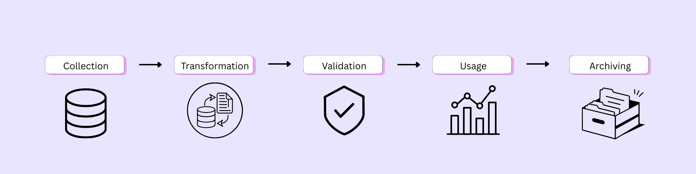
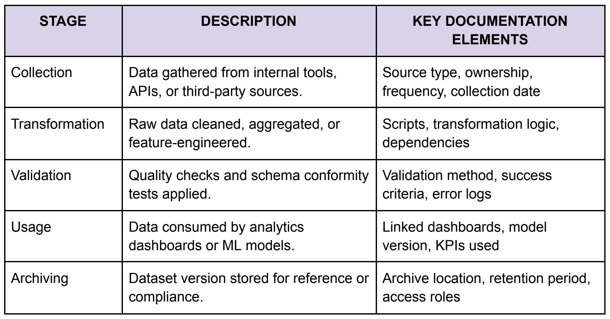

# Dataset lifecycle

A dataset in a SaaS environment typically moves through several stages:

1. Collection
2. Transformation
3. Validation
4. Usage
5. Archiving

Documentation should follow this lifecycle so that teams can understand how a dataset was created, changed, validated, and used.

*Documentation requirements at each stage of the dataset lifecycle.*

## Collection

Document where the data originates and how it is collected.

Include:

- Source type
- Data owner
- Collection frequency
- Collection date

## Transformation

Record how raw data is cleaned, aggregated, or otherwise transformed.

Include:

- Transformation logic
- Scripts or queries
- Dependencies
- Source datasets

## Validation

Document the checks used to confirm that the dataset is accurate and usable.

Include:

- Validation methods
- Success criteria
- Error logs
- Schema checks

## Usage

Record where and how the dataset is used.

Include:

- Analytics dashboards
- ML models
- Dataset version
- Relevant KPIs

## Archiving

Document how previous dataset versions are retained.

Include:

- Version
- Archive location
- Retention period
- Access permissions
