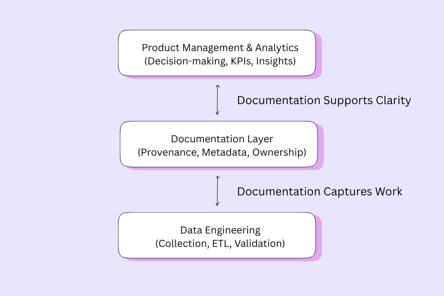

# Introduction

[← Guide home](../README.md#documentation) · Document 1 of 10

## On this page

- [Purpose of the guide](#purpose-of-the-guide)
- [Audience and assumed knowledge](#audience-and-assumed-knowledge)
- [Why consistent documentation matters](#why-consistent-documentation-matters)
- [Scope and documentation layers](#scope-and-documentation-layers)
- [How to use the guide](#how-to-use-the-guide)
- [Minimum useful dataset record](#minimum-useful-dataset-record)
- [Shared vocabulary](#shared-vocabulary)
- [Origin and further reading](#origin-and-further-reading)

## Purpose of the guide

This guide explains how to document datasets used in AI and machine learning systems within SaaS analytics environments. It connects technical records about data sources, transformations, and validation with the context people need to interpret metrics, choose model inputs, and make product decisions.

Documentation often becomes an afterthought. A pipeline may run successfully while nobody can explain why a field is missing, which customers a dataset represents, or whether a dashboard still uses the approved metric definition. The goal is to make those answers available before a dataset is reused.

By the end of the guide, readers should be able to:

- Identify the information a dataset record needs and assign responsibility for maintaining it.
- Explain how a dataset moves from collection through transformation, validation, use, and retirement.
- Connect business definitions to schemas, queries, dashboards, and model development.
- Record limitations, privacy decisions, and evidence needed to assess suitability for a particular use.
- Establish review and change processes that keep documentation useful as systems evolve.

## Audience and assumed knowledge

The guide assumes basic familiarity with tables, fields, and analytics. It does not require a specialized machine learning background.

| Reader | Main questions the guide should answer |
| --- | --- |
| Data engineer | Where does the data come from, how is it transformed, and what checks protect downstream consumers? |
| Product manager | What does the metric mean, which users are represented, and what decisions can the evidence support? |
| Data analyst | What is the unit of analysis, how should tables be joined, and which filters or caveats apply? |
| Data scientist or ML engineer | Are features and labels appropriate, are historical inputs available, and can training and evaluation be reproduced? |
| Technical writer | Is the information findable, consistent, understandable, and maintained? |
| Privacy, security, or compliance reviewer | What information is sensitive, which uses are approved, and where is the supporting evidence? |
| Team lead | Who owns the record, what is overdue, and who can approve a change or accept a limitation? |

## Why consistent documentation matters

SaaS data often arrives continuously from product events, billing platforms, support tools, and external services. Those systems can disagree about customer identity, time, subscription status, and what counts as an action. Without a shared reference, teams may duplicate work or report different answers to the same question.

Consistent documentation helps maintain trust by exposing provenance and assumptions; improves engineering and product collaboration; reduces onboarding and audit friction; and makes fairness and reproducibility questions easier to investigate. It supplies evidence for review, rather than proving that a dataset is accurate, fair, or compliant simply because a page exists.

*Documentation captures engineering work and provides context for analytics and product decisions.*

For example, a rise in daily active users could reflect customer growth, a new event definition, or duplicate event ingestion. A useful dataset record helps a reader distinguish these explanations by linking the metric definition, release history, and validation results.

## Scope and documentation layers

The main focus is structured datasets for product analytics and predictive ML. The same record structure can support text, image, or other data, but those uses need additional collection, labeling, rights, and evaluation details.

Keep the following records connected rather than trying to put everything in a single page:

| Record | What belongs there |
| --- | --- |
| Dataset record | Purpose, population, grain, source, schema, ownership, limitations, access route, and release status |
| Pipeline or transformation record | Extraction logic, joins, filters, feature derivations, dependencies, and execution evidence |
| Metric definition | Business meaning, calculation, denominator, exclusions, time window, and interpretation |
| Validation report | Checks performed on an identified release or run, results, exceptions, and decisions |
| Model record | Intended use, training and evaluation context, performance, limitations, and deployment decisions |
| Governance record | Approvals, risk assessments, access decisions, retention rules, and accountable reviewers |

A dataset page should summarize these records and link to the authoritative evidence. Restricted evidence should remain in its approved location; a public guide can describe the fields without exposing the underlying records.

## How to use the guide

For a new dataset, follow the chapters in order. For an existing dataset, start with [Templates and examples](templates-and-examples.md), fill the record using available evidence, and use the other chapters to resolve gaps.

1. Identify the dataset and the decision or workflow it supports.
2. Assign an owner and define one row, one event, or one observation precisely.
3. Record sources, schema, transformations, and the population covered.
4. Establish validation checks, evidence locations, and failure responses.
5. Review allowed uses, exclusions, access, and privacy considerations.
6. Publish an approved record alongside a traceable release.
7. Maintain it through change-triggered updates and scheduled reviews.

Scale the depth to the consequences of misuse. A temporary internal exploration may need a compact record; a production feature or business-critical dashboard needs fuller evidence and review. Even a small dataset needs an owner, a purpose, a definition of its contents, and visible limitations.

## Minimum useful dataset record

A reader should be able to answer these questions without relying on the creator's memory:

- What is the dataset for, and which uses are outside its scope?
- What does one row represent, and which population and period are covered?
- Where does it come from, and what changes were applied?
- Which version or snapshot am I using, and how fresh is it?
- What validation has been performed, and what problems remain?
- Who owns it, how do I request access, and where do I report an issue?
- Which restrictions, missing groups, or measurement limitations affect interpretation?

Use explicit statuses such as **Unknown**, **Not assessed**, or **Not applicable — reason**. An empty field should not imply approval or the absence of risk. Give material unknowns an owner and a follow-up date.

## Shared vocabulary

| Term | Meaning in this guide |
| --- | --- |
| Dataset grain | The entity or event represented by one row, such as one product event or one account per day |
| Provenance | The origins and creation history of the data |
| Lineage | The path through sources, transformations, outputs, and consumers |
| Metadata | Information describing the dataset or its fields |
| Data contract | An agreed set of expectations between a producer and its consumers |
| Snapshot | A fixed view of data at an identified point or cutoff |
| Schema drift | A change in fields, types, structure, or constraints relative to an expected schema |
| Data leakage | Information entering model development or evaluation that would not legitimately be available at prediction time or under the evaluation design |
| Freshness | How current data is relative to an expected availability schedule |
| Deprecation | Notice that a dataset or field will be retired or replaced |

## Origin and further reading

This expanded guide is adapted from Onkar Chatha's original *Data Documentation Guide for AI/ML Systems*. It retains the original subject areas and visuals, restores the worked examples, and adds operational guidance. New scenarios, thresholds, and role assignments are illustrative starting points, not claims about a deployed system.

For complementary approaches, *[Datasheets for Datasets](https://arxiv.org/abs/1803.09010)* proposes documenting a dataset's motivation, composition, collection, and recommended uses. *[Model Cards for Model Reporting](https://arxiv.org/abs/1810.03993)* addresses reporting about trained models. The two records serve different purposes and should be linked when a dataset supports a model.

The [NIST AI Risk Management Framework 1.0](https://www.nist.gov/publications/artificial-intelligence-risk-management-framework-ai-rmf-10) provides a broader voluntary risk-management reference. This guide is not a certification checklist; teams should document the policies and review requirements that actually apply to their work.

---

| Previous | Guide | Next |
| :--- | :---: | ---: |
| — | [All documents](../README.md#documentation) | [Dataset lifecycle →](dataset-lifecycle.md) |
