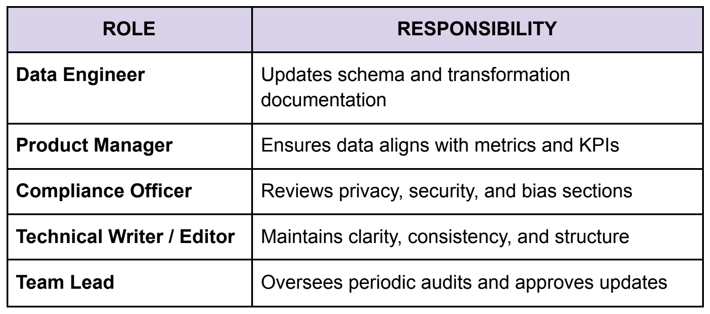

# Maintenance and governance

[← Guide home](../README.md#documentation) · Document 10 of 10

Documentation needs clear ownership and regular maintenance to remain useful as datasets, systems, and teams change.

## Choose a documentation location

Teams may maintain dataset documentation in platforms such as:

- GitHub
- Notion
- Confluence
- Internal documentation systems

Regardless of platform, documentation should use a consistent structure and provide clear links between datasets, dashboards, and related technical resources.

## Establish review cycles

Review documentation regularly to keep it aligned with the systems it describes.

A possible review schedule includes:

- Monthly: Review metadata and schema changes
- Quarterly: Review bias, fairness, and quality documentation
- Annually: Audit permissions, retention policies, and governance information

Review frequency should reflect how quickly the underlying dataset changes.

## Assign maintenance responsibilities

Clear ownership prevents documentation from becoming outdated.

Typical responsibilities may include:

- Data engineers maintaining schema and transformation details
- Product managers reviewing metric and KPI alignment
- Compliance teams reviewing privacy and governance information
- Technical writers or editors maintaining clarity and consistency
- Team leads overseeing periodic reviews

*Example division of responsibilities for maintaining the guide.*

## Keep documentation connected

As systems change:

- Update links to dashboards and repositories
- Record major changes
- Review outdated examples
- Revalidate ownership information
- Archive obsolete documentation when appropriate

---

| Previous | Guide | Next |
| :--- | :---: | ---: |
| [← Templates and examples](templates-and-examples.md) | [All documents](../README.md#documentation) | — |
