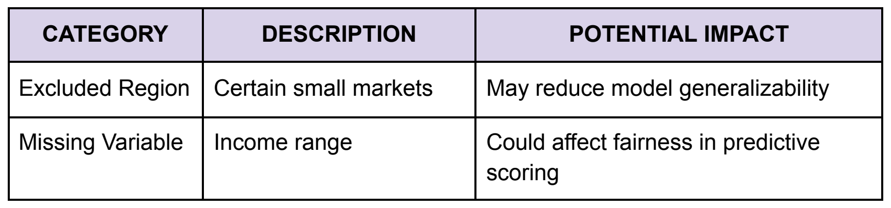

# Privacy, fairness, and reproducibility

[← Guide home](../README.md#documentation) · Document 8 of 10

Dataset documentation should capture not only how data is structured and maintained, but also the limitations, risks, and decisions that may affect how it can be used.

## Document bias and fairness considerations

For datasets used in AI and machine learning systems, record information that may affect model fairness.

Include:

- Demographic variables included or excluded
- Sampling methodology
- Known gaps or limitations
- Bias testing methods
- Fairness metrics
- Mitigation steps

Bias assessments should record when testing occurred, which methods were used, and any actions taken in response to the results.

## Record exclusions and limitations

Document populations, attributes, regions, or use cases that are not represented in the dataset.

For each limitation, record:

- What was excluded
- Why it was excluded
- Potential impact
- Relevant constraints on dataset use

Making these limitations explicit helps teams assess whether a dataset is appropriate for a particular analysis or model.

*Record exclusions and missing variables together with their potential impacts.*

## Document privacy and consent

Dataset documentation should identify privacy and security considerations such as:

- Presence of personally identifiable information
- Anonymization or hashing methods
- Data retention periods
- Deletion policies
- Consent requirements
- Access restrictions

## Support reproducibility

Documentation should allow another team member to understand how a dataset was created and used.

Include:

- Data lineage
- Transformation history
- Validation results
- Dataset version
- Bias testing results
- Reproducibility notes

---

| Previous | Guide | Next |
| :--- | :---: | ---: |
| [← Analytics workflows and integration](analytics-workflows-and-integration.md) | [All documents](../README.md#documentation) | [Templates and examples →](templates-and-examples.md) |
