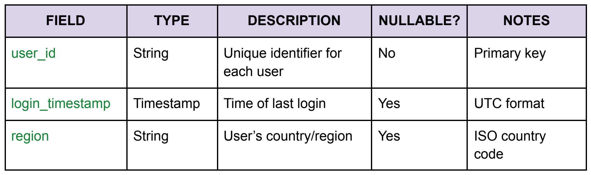

# Schema and metadata standards

[← Guide home](../README.md#documentation) · Document 4 of 10

## On this page

- [Define meaning before listing fields](#define-meaning-before-listing-fields)
- [Field naming conventions](#field-naming-conventions)
- [Field metadata to record](#field-metadata-to-record)
- [Example schema from the original guide](#example-schema-from-the-original-guide)
- [Document transformations and feature engineering](#document-transformations-and-feature-engineering)
- [Document labels and human annotation](#document-labels-and-human-annotation)
- [Prevent time and training-data leakage](#prevent-time-and-training-data-leakage)
- [Establish a data contract](#establish-a-data-contract)
- [Schema change checklist](#schema-change-checklist)

## Define meaning before listing fields

A schema describes structure, but a useful data dictionary also explains meaning. Start with the dataset's grain: what does one row represent? Identify its keys, scope, units, and time conventions before documenting individual fields.

For example, `user_id` can be unique in a user-profile table and repeat many times in an event table. Calling it a primary key everywhere would create a misleading contract. Distinguish a field that identifies a person or account from the key that uniquely identifies a row.

## Field naming conventions

Use descriptive names and a consistent casing convention. The original guide suggests `[entity]_[attribute]_[unit]`, such as `user_login_count_daily`. Treat that as a pattern where it helps, not a requirement to force every field into three parts.

- Prefer a clear name over an unexplained abbreviation.
- Use one convention, such as `snake_case`, within a schema.
- Include units or windows where ambiguity is likely: `duration_seconds` or `usage_days_last_30`.
- Distinguish identifiers, counts, rates, and flags.
- Avoid names whose meaning changes between datasets without explanation.
- Preserve source field names in a mapping when you rename them.

Document the business definition separately. A name such as `active_user` does not explain which events count as activity, whether internal accounts are excluded, or which time zone defines a day.

## Field metadata to record

| Attribute | Documentation requirement |
| --- | --- |
| Name and type | Exact field name and logical/storage type where the distinction matters |
| Description | Plain-language meaning, including the entity or event described |
| Nullable | Whether missing values are allowed and what they mean |
| Default | Any value inserted when an input is absent, and why |
| Units and range | Measurement unit, plausible range, precision, and rounding |
| Allowed values | Categories, code system, enum revision, or reference table |
| Key role | Primary, composite, foreign, or non-key; uniqueness scope |
| Time meaning | Event time, ingestion time, snapshot date, or validity period; time zone |
| Origin | Source field or derivation reference |
| Sensitivity | Classification or restricted handling requirements |
| Example | A synthetic value that illustrates format without exposing real records |
| Change status | Introduction, deprecation, replacement, or compatibility notes |

Do not conflate `null`, zero, an empty string, “unknown,” and “not applicable.” If several missingness reasons matter, store or describe them explicitly. A zero ticket count can mean no tickets only when source coverage is complete; otherwise it may mean unavailable data.

## Example schema from the original guide

This example assumes **one row per user**. It is a user-level record, not the event dataset introduced later.

| Field | Type | Description | Nullable | Notes |
| --- | --- | --- | --- | --- |
| `user_id` | String | Unique user identifier within the documented scope | No | Primary key for this example |
| `login_timestamp` | Timestamp | Time of the user's most recent recorded login | Yes | UTC; explain whether missing means no observed login |
| `region` | String | User's recorded country or region | Yes | Specify the exact code standard and how the value is obtained |

View the schema table from the original guide

The original table refers to an ISO country code. In an operational record, name the specific standard and format rather than leaving “ISO” undefined. Clarify whether region means a billing country, declared residence, or inferred location; those meanings are not interchangeable.

## Document transformations and feature engineering

A transformation record should explain what changed and why, then point to the implementation. Avoid copying a large query into multiple pages when a versioned reference and a concise explanation will stay accurate longer.

| Field | What to record |
| --- | --- |
| Transformation ID | Stable reference and descriptive name |
| Inputs | Source dataset IDs and release or snapshot identifiers |
| Logic | Filters, joins, aggregations, cleaning, normalization, and calculations |
| Purpose | Why the output or feature is needed |
| Dependencies | Reference data, upstream jobs, packages, and learned parameters |
| Implementation | Script, query, notebook, or pipeline revision |
| Output | Resulting grain, fields, types, and location |
| Edge cases | Missing inputs, duplicates, late arrivals, unmatched joins, and invalid values |
| History | Author, reviewer, effective date, and related change record |

For a feature such as `usage_days_last_30`, explain which actions qualify, how distinct days are counted, which time zone defines a day, and whether the window includes the prediction date. Record how corrections and backfills affect historical values.

A precise illustrative definition is: “Count distinct UTC dates with at least one qualifying event in the 30-day interval ending immediately before the prediction cutoff.” That is more actionable than “recent engagement.” The actual qualifying events and cutoff rules still need to be listed.

## Document labels and human annotation

When labels are assigned by people or generated from rules, describe the labeling process as part of the dataset's creation history. A label is a measurement or judgment with assumptions, not automatically a reliable ground truth.

Record the label definition, instruction version, label source, annotator role or qualification, quality review method, and how disagreements are resolved. Document ambiguous cases, unavailable outcomes, corrections, and any use of model-generated suggestions. Keep identifying details about annotators restricted where appropriate.

For a rule-derived target such as `churned`, link the business definition to the exact calculation and observation window. Distinguish a confirmed negative outcome from one that has not yet had time to occur. If the labeling rule changes, assess whether older labels and evaluation results remain comparable.

For text or image collections, also record the unit being labeled, category definitions, any redaction or preprocessing, and how duplicate or closely related items are handled across evaluation partitions. Include an approved synthetic example of an easy case and an ambiguous case when that will help future reviewers apply the instructions consistently.

## Prevent time and training-data leakage

For ML inputs, distinguish when an event happened from when its value became available. An input can have an earlier event timestamp but arrive too late to be known at the historical prediction cutoff. Record both when this affects validity.

Fit learned preprocessing on the training partition, then apply the fitted transformation to validation and test data. Fitting an imputer or scaler on the full dataset can let evaluation data influence training. The [scikit-learn common-pitfalls guide](https://scikit-learn.org/stable/common_pitfalls.html) explains this failure mode and the role of pipelines in keeping preprocessing consistent.

Document split membership, cutoff dates, label availability, feature windows, and the treatment of repeated users or accounts. The split strategy should match the intended prediction setting, as described in [analytics workflows](analytics-workflows-and-integration.md).

## Establish a data contract

A data contract is an agreement between producers and consumers about expectations. It can be a reviewed document or a machine-readable specification, but it needs an owner and a process for changes.

Include schema, keys, meaning, freshness, quality expectations, allowed uses, support route, and compatibility rules. State which checks are enforced automatically and which require review. A contract written in Markdown is not automatically enforced by the pipeline.

A change can be breaking even without a type change. Redefining “active” or changing a count from user-level to account-level may alter every downstream result. Conversely, adding an optional field may be compatible for some consumers but break strict parsers. Assess impact rather than relying on labels alone.

## Schema change checklist

- [ ] The row meaning and key constraints remain explicit.
- [ ] New or changed fields have definitions, missing-value rules, and examples.
- [ ] Transformations and source mappings point to the right revision.
- [ ] Consumers and model features affected by changed meaning are identified.
- [ ] Migration, validation, and deprecation details are documented.
- [ ] The change is linked to a release record and an accountable reviewer.

---

