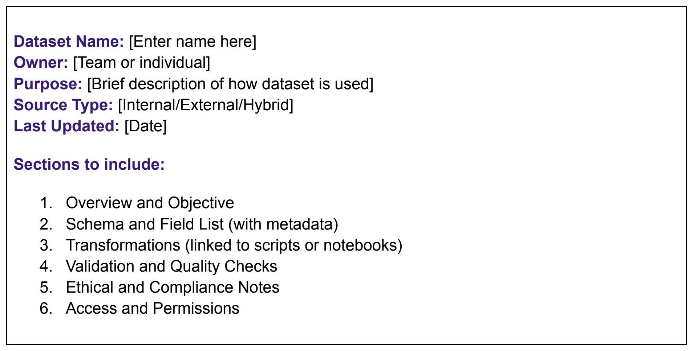
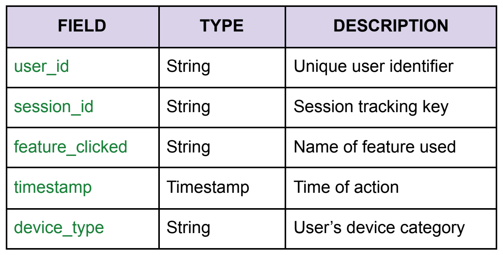
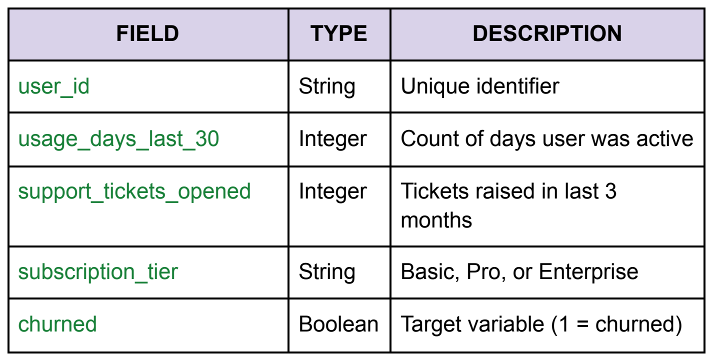

# Templates and examples

[← Guide home](../README.md#documentation) · Document 9 of 10

## On this page

- [How to use the templates](#how-to-use-the-templates)
- [Dataset documentation template](#dataset-documentation-template)
- [Example: user behavior dataset for product analytics](#example-user-behavior-dataset-for-product-analytics)
- [Example: predictive retention model dataset](#example-predictive-retention-model-dataset)
- [Validation and change records](#validation-and-change-records)
- [Completion checklist](#completion-checklist)

## How to use the templates

Start with the dataset record below, then add detail in linked records when a page becomes difficult to maintain. Replace placeholders with verified information. Mark unknowns explicitly and assign follow-up rather than inventing a value to make the template look complete.

The two worked examples restore the scenarios in the original guide. Their original fields and source notes are retained, while additional operational choices are labeled illustrative. They describe documentation patterns, not measured results from a deployed system.

## Dataset documentation template



*The original template provides a compact starting point. The copyable version below adds release, coverage, evidence, and maintenance details.*

```markdown
# [Dataset name]

## Record status
- Stable dataset ID:
- Status: Draft / Under review / Active / Restricted / Deprecated / Archived
- Dataset release or snapshot:
- Schema version:
- Documentation revision:
- Primary owner and backup:
- Technical maintainer:
- Business definition owner:
- Reviewers and approval status:
- Last updated / last reviewed / next review due:
- Contact and issue-reporting route:

## Overview and objective
- Purpose and decision supported:
- Intended consumers:
- Approved uses:
- Unsuitable or restricted uses:
- Grain: one row represents...
- Primary or composite key:
- Population and eligibility:
- Geographic, product, and time coverage:
- Refresh cadence and expected availability:

## Provenance and lineage
- Source type: Internal / External / Hybrid
- Source IDs, owners, versions, and access references:
- Extraction method and implementation revision:
- Collection or extraction time and input cutoff:
- Sampling, filters, exclusions, and opt-outs:
- License, contract, or policy restrictions:
- Lineage description or diagram:
- Downstream datasets, dashboards, and models:

## Schema and field list
| Field | Type | Meaning | Nullable/default | Units/range/values | Key role | Source | Sensitivity |
| --- | --- | --- | --- | --- | --- | --- | --- |
| [field] | [type] | [definition] | [rule] | [constraints] | [role] | [reference] | [classification] |

- Time zones and timestamp meanings:
- Identifier scope and join rules:
- Synthetic example records:
- Schema change and deprecation notes:

## Transformations
- Scripts, queries, or notebooks and their revisions:
- Input and output dataset identifiers:
- Cleaning, filters, joins, aggregations, and normalization:
- Feature definitions and observation windows:
- Missing values, duplicates, outliers, and late-arriving data:
- Dependencies, reference data, and fitted parameters:
- Transformation change history:

## Validation and quality
- Rule definitions, thresholds, rationale, and owners:
- Check schedule and scope:
- Latest report and assessed release:
- Pass / warning / fail / not-run summary:
- Known issues and consumer impact:
- Release decision and approver:
- Accepted exceptions and expiry or review date:

## Ethical, privacy, and security notes
- Representation, exclusions, and expected limitations:
- Bias assessment method, date, tool, results, and reviewer:
- Mitigations and residual concerns:
- Sensitive information categories:
- Approved purposes and relevant review references:
- Collection notices, consent or preference records where relevant:
- Protection methods and residual linkage risks:
- Retention period, deletion process, and responsible owner:

## Access and permissions
- Documentation audience:
- Data access audience and request route:
- Roles allowed to edit, approve, archive, or delete:
- Sharing and redistribution restrictions:
- Access-review date and reviewer:

## Usage and reproducibility
- Metric, dashboard, report, and model references:
- Input snapshots and output identifiers:
- Code, configuration, dependencies, environment, and seeds:
- Reproduction procedure and verification criteria:
- Access or retention constraints affecting reproduction:

## Maintenance and change history
- Review schedule and event-triggered updates:
- Latest change, author, reviewer, and release date:
- Related issues, commits, or approvals:
- Migration or deprecation instructions:
- Open questions with owners and due dates:
```

## Example: user behavior dataset for product analytics

**Purpose from the original guide:** track how users interact with key features across sessions.

| Record element | Original scenario |
| --- | --- |
| Source | Internal event-tracking API |
| Refresh frequency | Hourly |
| Ownership | Data Engineering and Product Analytics |
| Coverage limitation | Event-based collection underrepresents inactive users |

### Original schema snapshot

| Field | Type | Description |
| --- | --- | --- |
| `user_id` | String | Unique identifier for a user; repeats across that user's events |
| `session_id` | String | Session tracking key |
| `feature_clicked` | String | Name of the feature used |
| `timestamp` | Timestamp | Time of the action |
| `device_type` | String | User's device category |

<details>
<summary>View the user behavior schema from the original guide</summary>



</details>

### Additional documentation for this example

**Illustrative grain:** one accepted feature-interaction event. Neither `user_id` nor `session_id` is a row key because a user or session can generate multiple events. Add a source event identifier if available, or document a deduplication key and its limitations. For a multi-tenant system, document whether identifiers are unique across all tenants or only within each tenant.

**Time:** interpret `timestamp` as event time and separately record ingestion time if lateness matters. Define the time zone, session boundary rules, and the window during which historical activity totals may still change.

**Transformations:** normalize known event names through a versioned mapping; apply approved eligibility filters; deduplicate according to the documented event key; and retain counts of rejected or quarantined records. Explain how renamed features map to earlier history.

**Validation:** check required identifiers, timestamp parsing, allowed event names, duplication, and hourly freshness. Compare received and accepted counts. If a device category is missing, distinguish a collection problem from a permitted unknown value.

**Suitable use:** analysis of observed feature interactions within the documented population and collection coverage.

**Limitation:** the event table alone cannot provide a denominator of all eligible users. Users who never act, cannot be observed, or are excluded by collection choices may be absent. A feature-adoption rate needs an approved population source and a documented join.

**Privacy and access:** pseudonymous IDs may still be linkable. Document approved audiences, collection preferences, protection methods, and retention in the operational record. This example does not specify actual permissions or retention periods.

**Example issue:** a client retry delivers the same event twice. The record should explain the deduplication rule, how affected historical aggregates are corrected, and which consumers receive a correction notice.

### Synthetic event example

```json
{
  "user_id": "user-example-001",
  "session_id": "session-example-014",
  "feature_clicked": "report_export",
  "timestamp": "2026-09-01T14:05:00Z",
  "device_type": "desktop"
}
```

This synthetic row illustrates the original fields. It intentionally does not establish a unique event key; that additional design decision must be documented before relying on uniqueness checks.

## Example: predictive retention model dataset

**Purpose from the original guide:** train a model to predict user churn risk.

| Record element | Original scenario |
| --- | --- |
| Sources | Product analytics, billing, and support CRM |
| Processing | Aggregation and normalization scripts |
| Exclusion | Users who opted out of tracking |
| Intended output | A training dataset for a retention prediction model |

### Original metadata overview

| Field | Type | Description |
| --- | --- | --- |
| `user_id` | String | Unique user identifier |
| `usage_days_last_30` | Integer | Number of active days in the preceding 30-day window |
| `support_tickets_opened` | Integer | Tickets raised in the last three months |
| `subscription_tier` | String | Basic, Pro, or Enterprise |
| `churned` | Boolean | Target variable: 1 indicates churn under the defined outcome rule |

<details>
<summary>View the retention schema from the original guide</summary>



</details>

### Define a complete prediction problem

The original example does not specify the prediction cutoff, future outcome window, or repeated observation structure. These must be added before implementation. The following is **one illustrative design**, not a prescribed business definition:

- **Grain:** one eligible user at one UTC prediction cutoff. Add `prediction_cutoff` to the record; repeated cutoffs require a composite row key.
- **Eligibility:** users with a qualifying active subscription at the cutoff and sufficient approved source coverage. State how trials, internal accounts, opted-out users, and multiple subscriptions are treated.
- **Feature window:** count active UTC dates in the 30-day interval ending just before the cutoff. Count support tickets in the preceding three calendar months and state boundary handling explicitly.
- **Tier:** use the subscription tier valid at the cutoff, not its current value at extraction time.
- **Outcome:** for this example, churn means cancellation becomes effective within 30 days after the cutoff. Alternative meanings such as non-renewal or inactivity require different label definitions.
- **Label maturity:** do not mark a recent observation “not churned” until the complete outcome window is observable. Identify delayed billing updates and incomplete follow-up.

If retention is actually managed at the account level, use an account-level prediction unit and redefine the joins and features. Do not silently treat user-level and account-level churn as the same target.

### Sources, transformations, and validation

Document the mapping between product user IDs, subscription records, and support identities. Specify how unmatched records and multiple accounts are handled. Record the aggregation and normalization code revision, and ensure historical features use values available at the cutoff.

Suggested checks include uniqueness of the declared composite key, expected feature ranges, complete label windows, valid tier values, join coverage, and the absence of post-cutoff information in features. Missing support history should not become zero tickets without a justified completeness rule.

### Evaluation and limitations

Use a split design that matches the planned deployment. For future prediction on existing users, time-based evaluation may be relevant; for unseen accounts, account grouping may also matter. Document overlap between observation windows and whether repeated entities occur across partitions.

Preserve the source limitation: opted-out users are excluded. The resulting population may differ from the population a product team wants to serve. Document who is represented, which intended uses remain supported, and which conclusions cannot be generalized.

Do not publish a performance claim until an identified model has been evaluated on an identified dataset. This example provides a documentation design, not evidence of predictive accuracy or fairness.

## Validation and change records

Use the [validation report template](data-quality-and-validation.md#validation-report-template) for check results and the [change log template](version-control-and-audit-trails.md#maintain-a-useful-change-log) for releases. Reference them from the dataset record instead of duplicating changing evidence in several places.

## Completion checklist

- [ ] Placeholders have been replaced with verified information or explicit unknowns.
- [ ] Grain, keys, time windows, and population are consistent across the record.
- [ ] Synthetic examples are clearly separated from actual operational evidence.
- [ ] Validation and approval references exist for the declared release status.
- [ ] Limitations, access, retention, ownership, and review dates are usable by a new reader.

---

| Previous | Guide | Next |
| :--- | :---: | ---: |
| [← Privacy, fairness, and reproducibility](privacy-fairness-and-reproducibility.md) | [All documents](../README.md#documentation) | [Maintenance and governance →](maintenance-and-governance.md) |
