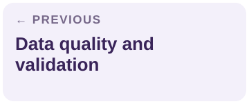
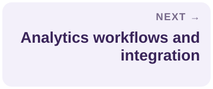

# Version control and audit trails

[← Guide home](../README.md#documentation) · Document 6 of 10

## On this page

- [Track the different things that change](#track-the-different-things-that-change)
- [Maintain a useful change log](#maintain-a-useful-change-log)
- [Assess compatibility](#assess-compatibility)
- [Review and release workflow](#review-and-release-workflow)
- [Access control and permissions](#access-control-and-permissions)
- [Preserve an audit trail](#preserve-an-audit-trail)
- [Recovery, deprecation, and retirement](#recovery-deprecation-and-retirement)
- [Review checklist](#review-checklist)

## Track the different things that change

A dataset, its schema, its transformation code, and its documentation can change independently. Track their relationship so a reader can reconstruct what was actually used.

| Identifier | What it identifies |
| --- | --- |
| Dataset ID | The continuing identity of the dataset |
| Data release or snapshot | The records made available at a particular release or cutoff |
| Schema version | The structural and semantic contract |
| Code revision | The queries, scripts, and configuration used to create the output |
| Documentation revision | The explanation applicable to that release |
| Model or report version | A consumer that depends on the data |

A Git commit can identify documentation and code, but it does not by itself preserve a live database. Record the actual snapshot, export, or immutable data reference where reproducibility is required. Keep large or restricted data in an appropriate storage system rather than placing it in a public repository.

## Maintain a useful change log

The original guide calls for version ID, release date, change summary, author, approver, and related commits or tickets. Extend that record with impact and migration information when a change affects consumers.

```text
Dataset ID:
New release / previous release:
Released at (with time zone):
Author / reviewer / approver:
Change summary and reason:
Fields, definitions, populations, or periods affected:
Source and transformation revisions:
Validation report and result:
Compatibility assessment:
Known limitations and accepted exceptions:
Affected dashboards, reports, and models:
Migration steps and support route:
Rollback or recovery approach:
Related commit, pull request, and issue:
Next review or deprecation date:
```

Prefer “exclude internal test accounts from the eligible-user denominator” to “update query.” The first tells a product reader why a metric may change.

## Assess compatibility

Document what a consumer must do differently. Structural changes, semantic changes, population changes, and historical corrections can all be consequential.

| Change | Questions to answer |
| --- | --- |
| Add a field | Is it optional, and do consumers tolerate additional fields? |
| Remove or rename a field | What replaces it, and how long is the old form supported? |
| Change a type or unit | Will parsing, calculations, precision, or storage assumptions change? |
| Change a metric definition | Which historical comparisons are no longer like-for-like? |
| Change source coverage | Are different customers, markets, or periods represented? |
| Backfill or correct history | Which published results need to be regenerated? |
| Change a model feature or label | Does training, evaluation, or deployed inference need a coordinated update? |

Choose a version naming convention that works for the team. A date plus release number may be enough; more formal versioning can help when contracts are maintained. Define the convention rather than assuming a familiar number format guarantees compatibility.

## Review and release workflow

1. Open a change request describing the problem, proposed behavior, and affected consumers.
2. Update implementation, schema, and documentation together where they depend on one another.
3. Run relevant checks and attach the evidence.
4. Request review from technical and business owners; add specialist review when scope requires it.
5. Record approval and any conditions before releasing the new version.
6. Publish release notes and notify affected consumers through the team's normal channel.
7. Confirm adoption or migration and retire superseded versions according to policy.

Use pull requests or an equivalent review mechanism for changes that need review. A small editorial correction and a changed churn definition do not require the same level of evidence. Record the review rule so contributors know what is expected.

## Access control and permissions

Define who may view, edit, approve, archive, and delete documentation. Distinguish access to the **documentation** from access to the **underlying data**. Someone may be allowed to discover that a restricted dataset exists without being allowed to download its records.

The original guide provides this illustrative role matrix:

| Role | View docs | Edit docs | Archive or delete docs | Main contribution |
| --- | --- | --- | --- | --- |
| Data engineer | Yes | Yes | With approval | Schema and transformation updates |
| Product manager | Yes | Request changes | No | Metric alignment and business context |
| Data analyst | Yes | Request changes | No | Reporting and analysis feedback |
| Compliance officer | Yes | Yes | No | Privacy, sensitive-data handling, and review evidence |
| Technical writer | Yes | Yes | No | Clarity, structure, and formatting |
| Team lead or administrator | Yes | Yes | As authorized | Major updates and archival decisions |

These are examples, not default access grants. Adapt them to the organization's actual responsibilities, sensitivity levels, and approval controls. Archiving and deletion may require different permissions even though the source table combines them.

<details>
<summary>View the permissions matrix from the original guide</summary>


</details>

Review permissions during role changes, ownership handoffs, and periodic access reviews. Do not document credentials or grant access merely because a role appears in an example table.

## Preserve an audit trail

An audit trail should connect a change to its reason, author, evidence, reviewer, release, and consumers. Use stable references and keep timestamps unambiguous. Record where supporting reports live and how long they remain available.

Git history is useful but may not meet every organization's audit requirements. If evidence must be protected from alteration or retained under a specific policy, record the designated evidence system and controls. A public commit history alone does not establish regulatory compliance.

## Recovery, deprecation, and retirement

Document whether recovery means restoring an older snapshot, reverting a transformation, replaying source records, or rebuilding a downstream report. A code revert will not automatically undo data already published to other systems.

For deprecation, announce the replacement, migration steps, affected consumers, support period, and final retirement date. Leave a discoverable record explaining what happened. Confirm that important consumers have moved before removing their supported dependency.

## Review checklist

- [ ] Data, schema, code, and documentation identifiers are connected.
- [ ] The change log explains behavior and impact, not just file changes.
- [ ] Approval and validation evidence are traceable.
- [ ] Documentation and data permissions are distinguished.
- [ ] Consumers have migration and recovery guidance.
- [ ] Retired releases retain the permissible context needed to explain past use.

---

<p align="center">
<a href="data-quality-and-validation.md"></a>
<a href="../README.md#documentation"></a>
<a href="analytics-workflows-and-integration.md"></a>
</p>
