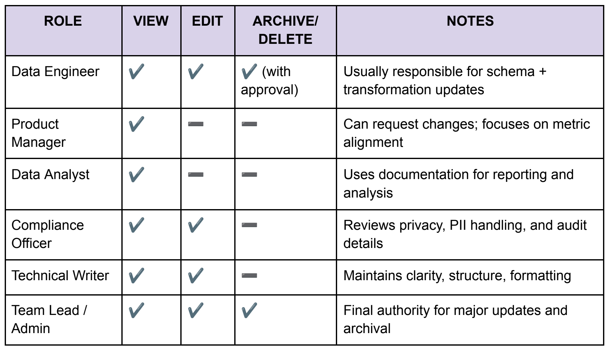

# Version control and audit trails

[← Guide home](../README.md#documentation) · Document 6 of 10

Version control helps teams understand how a dataset or its documentation has changed over time.

A clear audit trail makes it easier to review updates, trace decisions, and connect documentation changes to related work.

## Maintain change logs

Each dataset version should record:

- Version ID
- Release date
- Summary of changes
- Author
- Approver
- Related commits or tickets

Change logs help teams understand what changed, when it changed, and why.

## Link documentation to version history

Where possible, connect documentation updates to:

- Git commits
- Pull requests
- Issue tickets
- Release notes

This creates a traceable record between the documentation and the work that caused the change.

## Define access and permissions

Document who can:

- View dataset documentation
- Edit documentation
- Approve changes
- Delete or archive records

Access rules should align with the organization’s existing policies and ownership model.

*Illustrative role-based permissions; adapt these to your organization’s policies.*

## Why audit trails matter

A documented history supports:

- Troubleshooting
- Compliance reviews
- Handoffs
- Accountability
- Reproducibility

---

| Previous | Guide | Next |
| :--- | :---: | ---: |
| [← Data quality and validation](data-quality-and-validation.md) | [All documents](../README.md#documentation) | [Analytics workflows and integration →](analytics-workflows-and-integration.md) |
